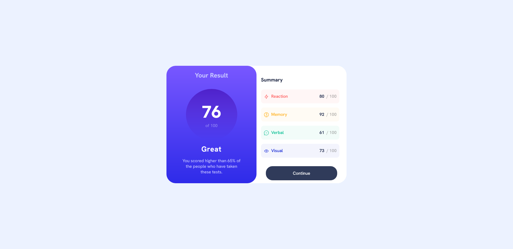
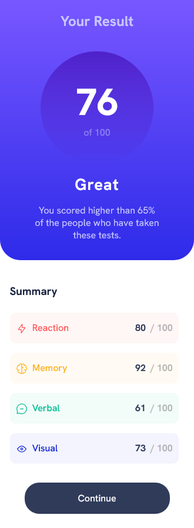

# Frontend Mentor - Results summary component solution

This is a solution to the [Results summary component challenge on Frontend Mentor](https://www.frontendmentor.io/challenges/results-summary-component-CE_K6s0maV). Frontend Mentor challenges help you improve your coding skills by building realistic projects. 

## Table of contents

- [Overview](#overview)
  - [The challenge](#the-challenge)
  - [Screenshot](#screenshot)
  - [Links](#links)
- [My process](#my-process)
  - [Built with](#built-with)
  - [What I learned](#what-i-learned)
  - [Continued development](#continued-development)
  - [Useful resources](#useful-resources)
- [Author](#author)
- [Acknowledgments](#acknowledgments)


## Overview

### The challenge

Users should be able to:

- View the optimal layout for the interface depending on their device's screen size
- See hover and focus states for all interactive elements on the page
- **Bonus**: Use the local JSON data to dynamically populate the content

### Screenshot




### Links

- Solution URL: [Add solution URL here](https://your-solution-url.com)
- Live Site URL: [Add live site URL here](https://your-live-site-url.com)

## My process

### Built with

- Semantic HTML5 markup
- CSS custom properties
- Flexbox
- Mobile-first workflow


### What I learned

This css was reused across all the skills scorings. it was a good use of DRY. 

```css
.proud-of-this-css {
    width: 90%;
    background-color: color-mix(in srgb, var(--result-reaction-score-bg-color) 5%, transparent);
    display: flex;
    color: var(--result-reaction-score-bg-color);
    font-weight: 500;
    padding: 15px 10px;
    margin-bottom: 1rem;
    border-radius: 10px;
    justify-content: space-between;
}
```

### Continued development

    I would focus on the focus state next and perhaps make the button animation more smoothly like a transition of some sort could fix this.
### Useful resources
https://www.w3schools.com/css/css_rwd_mediaqueries.asp
## Author

- Frontend Mentor - [@Fabio-Velasquez](https://www.frontendmentor.io/profile/Fabio-Velasquez)

## Acknowledgments

S/O to the Fe community.
